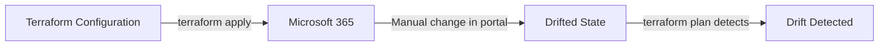
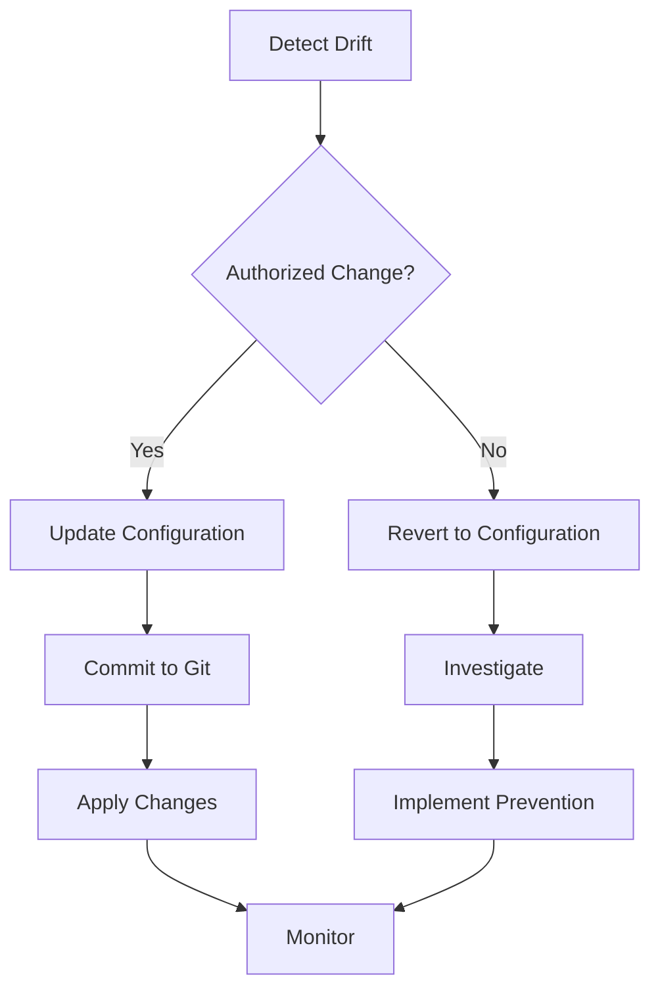

Configuration drift occurs when the actual state of Microsoft 365 resources diverges from what Terraform expects based on your configuration and state file. This guide explains how to detect drift, understand its causes, and implement strategies to prevent and resolve it.

## Understanding Configuration Drift

Drift happens when resources are modified outside of Terraform:



### What Causes Drift?

<AccordionGroup>
  <Accordion title="Manual changes in admin portals">
    Administrators modify resources through web portals:
    
    - Entra ID admin center
    - Microsoft Intune admin center
    - Microsoft 365 admin center
    - Security & Compliance center
    
    **Example:**
    ```hcl
    # Terraform configuration
    resource "microsoft365_graph_beta_groups_group" "engineering" {
      display_name = "Engineering Team"
      description  = "Engineering department"
    }
    ```
    
    Admin changes description in portal → **drift detected**
  </Accordion>
  
  <Accordion title="PowerShell or CLI modifications">
    Scripts or automation tools modify resources:
    
    ```powershell
    # PowerShell changes group outside Terraform
    Update-MgGroup -GroupId "12345678-1234-1234-1234-123456789abc" `
      -Description "Updated description"
    ```
    
    This creates drift if the group is managed by Terraform.
  </Accordion>
  
  <Accordion title="API calls from other tools">
    Other automation platforms make direct API calls:
    
    - Azure Automation runbooks
    - Logic Apps
    - Power Automate flows
    - Custom applications
  </Accordion>
  
  <Accordion title="Microsoft automatic changes">
    Microsoft 365 services automatically update resources:
    
    - Group membership updates from dynamic rules
    - License assignment changes
    - Policy inheritance from parent objects
    - Service-driven attribute updates
    - Schema extensions and default values
  </Accordion>
  
  <Accordion title="User self-service actions">
    End users modify resources they own or manage:
    
    - Group owners adding/removing members
    - Application owners updating app settings
    - Users changing their own profile attributes
  </Accordion>
</AccordionGroup>

## Detecting Drift

Terraform provides multiple ways to detect configuration drift.

### terraform plan

The most common method - compares configuration to actual state:

```bash
$ terraform plan

microsoft365_graph_beta_groups_group.engineering: Refreshing state... [id=12345678-1234-1234-1234-123456789abc]

Note: Objects have changed outside of Terraform

Terraform detected the following changes made outside of Terraform since the last "terraform apply":

  # microsoft365_graph_beta_groups_group.engineering has changed
  ~ resource "microsoft365_graph_beta_groups_group" "engineering" {
        id              = "12345678-1234-1234-1234-123456789abc"
      ~ description     = "Engineering department" -> "Engineering team - updated manually"
        display_name    = "Engineering Team"
        # (10 unchanged attributes hidden)
    }

No changes. Your infrastructure matches the configuration.

Your configuration already matches the changes detected above.
```

### terraform plan -refresh-only

Explicitly check for drift without planning changes:

```bash
$ terraform plan -refresh-only

microsoft365_graph_beta_groups_group.engineering: Refreshing state... [id=12345678-1234-1234-1234-123456789abc]

This is a refresh-only plan, so Terraform will not take any actions to undo these.
If you were expecting these changes then you can apply this plan to record the updated values in the Terraform state.

  # microsoft365_graph_beta_groups_group.engineering has changed
  ~ resource "microsoft365_graph_beta_groups_group" "engineering" {
        id              = "12345678-1234-1234-1234-123456789abc"
      ~ description     = "Engineering department" -> "Engineering team - updated manually"
        display_name    = "Engineering Team"
    }

Plan: 0 to add, 0 to change, 0 to destroy.
```

### terraform refresh

Update state to match reality without planning:

```bash
$ terraform refresh

microsoft365_graph_beta_groups_group.engineering: Refreshing state... [id=12345678-1234-1234-1234-123456789abc]
```

<Warning>
`terraform refresh` is deprecated in favor of `terraform apply -refresh-only`. The standalone `refresh` command updates state without showing you what changed first.
</Warning>

### Automated Drift Detection

Set up scheduled drift detection in CI/CD:

```yaml
# GitHub Actions example
name: Drift Detection

on:
  schedule:
    - cron: '0 */6 * * *'  # Every 6 hours
  workflow_dispatch:  # Manual trigger

jobs:
  detect-drift:
    runs-on: ubuntu-latest
    steps:
      - uses: actions/checkout@v4
      
      - name: Setup Terraform
        uses: hashicorp/setup-terraform@v3
        with:
          terraform_version: 1.14.0
      
      - name: Terraform Init
        run: terraform init
        env:
          M365_TENANT_ID: ${{ secrets.M365_TENANT_ID }}
          M365_CLIENT_ID: ${{ secrets.M365_CLIENT_ID }}
      
      - name: Detect Drift
        id: plan
        run: |
          terraform plan -detailed-exitcode -no-color
        continue-on-error: true
      
      - name: Comment PR on Drift
        if: steps.plan.outputs.exitcode == 2
        uses: actions/github-script@v7
        with:
          script: |
            github.rest.issues.create({
              owner: context.repo.owner,
              repo: context.repo.repo,
              title: 'Configuration Drift Detected',
              body: 'Drift detected in Microsoft 365 resources. Review and resolve.'
            })
```

## Common Drift Scenarios

### Scenario 1: Manual Description Update

**Configuration:**
```hcl
resource "microsoft365_graph_beta_groups_group" "engineering" {
  display_name = "Engineering Team"
  description  = "Engineering department"
}
```

**Manual change:** Admin updates description in portal to "Engineering team - updated"

**Detection:**
```bash
$ terraform plan

  # microsoft365_graph_beta_groups_group.engineering has changed
  ~ resource "microsoft365_graph_beta_groups_group" "engineering" {
      ~ description = "Engineering department" -> "Engineering team - updated"
    }

Plan: 0 to add, 1 to change, 0 to destroy.
```

**Resolution options:**
1. Update configuration to match manual change
2. Run `terraform apply` to revert to configuration
3. Use `lifecycle.ignore_changes` if attribute should be managed manually

### Scenario 2: Group Membership Changes

**Configuration:**
```hcl
resource "microsoft365_graph_beta_groups_group_member_assignment" "member" {
  group_id           = microsoft365_graph_beta_groups_group.engineering.id
  member_id          = microsoft365_graph_beta_users_user.john.id
  member_object_type = "User"
}
```

**Manual change:** Admin removes member through portal

**Detection:**
```bash
$ terraform plan

  # microsoft365_graph_beta_groups_group_member_assignment.member has been deleted
  - resource "microsoft365_graph_beta_groups_group_member_assignment" "member" {
      - group_id           = "12345678-1234-1234-1234-123456789abc" -> null
      - member_id          = "87654321-4321-4321-4321-cba987654321" -> null
      - member_object_type = "User" -> null
    }

Plan: 1 to add, 0 to change, 0 to destroy.
```

**Resolution:** Run `terraform apply` to re-add the member

### Scenario 3: Conditional Access Policy Changes

**Configuration:**
```hcl
resource "microsoft365_graph_beta_identity_and_access_conditional_access_policy" "mfa" {
  display_name = "Require MFA"
  state        = "enabled"
  
  conditions = {
    users = {
      include_users = ["All"]
    }
  }
  
  grant_controls = {
    built_in_controls = ["mfa"]
  }
}
```

**Manual change:** Admin changes state to "enabledForReportingButNotEnforced"

**Detection:**
```bash
$ terraform plan

  # microsoft365_graph_beta_identity_and_access_conditional_access_policy.mfa has changed
  ~ resource "microsoft365_graph_beta_identity_and_access_conditional_access_policy" "mfa" {
      ~ state = "enabledForReportingButNotEnforced" -> "enabled"
    }
```

<Warning>
Re-enabling a conditional access policy through Terraform could lock out users if not carefully planned. Always test policy changes in report-only mode first.
</Warning>

### Scenario 4: Intune App Settings Modified

**Configuration:**
```hcl
resource "microsoft365_graph_beta_device_and_app_management_win32_app" "chrome" {
  display_name = "Google Chrome"
  description  = "Google Chrome browser"
  publisher    = "Google LLC"
}
```

**Manual change:** Admin updates publisher to "Google"

**Detection:**
```bash
$ terraform plan

  # microsoft365_graph_beta_device_and_app_management_win32_app.chrome has changed
  ~ resource "microsoft365_graph_beta_device_and_app_management_win32_app" "chrome" {
      ~ publisher = "Google" -> "Google LLC"
    }
```

## Resolving Drift

### Option 1: Update Configuration (Recommended)

Accept the manual change by updating your Terraform configuration:

```hcl
# Update configuration to match reality
resource "microsoft365_graph_beta_groups_group" "engineering" {
  display_name = "Engineering Team"
  description  = "Engineering team - updated"  # Accept manual change
}
```

```bash
# Verify no drift after update
terraform plan
# No changes. Your infrastructure matches the configuration.
```

**When to use:**
- Manual change was intentional and should be kept
- Manual change represents better configuration
- Change was approved through change management

### Option 2: Revert to Configuration

Revert the resource to match your Terraform configuration:

```bash
# Apply configuration, reverting manual changes
terraform apply

Plan: 0 to add, 1 to change, 0 to destroy.

Do you want to perform these actions?
  Terraform will perform the actions described above.
  Only 'yes' will be accepted to approve.

  Enter a value: yes

microsoft365_graph_beta_groups_group.engineering: Modifying... [id=12345678-1234-1234-1234-123456789abc]
microsoft365_graph_beta_groups_group.engineering: Modifications complete after 2s
```

**When to use:**
- Manual change was unauthorized
- Configuration represents desired state
- Change violates compliance requirements

### Option 3: Ignore Changes

Ignore specific attributes that should be managed outside Terraform:

```hcl
resource "microsoft365_graph_beta_groups_group" "engineering" {
  display_name = "Engineering Team"
  description  = "Engineering department"
  
  lifecycle {
    ignore_changes = [
      description,  # Allow manual description updates
    ]
  }
}
```

```bash
# Terraform will ignore description drift
terraform plan
# No changes. Your infrastructure matches the configuration.
```

**When to use:**
- Attribute is managed by another process
- Attribute is frequently updated manually
- Attribute doesn't affect infrastructure state

### Option 4: Accept and Update State

Accept drift and update state without changing configuration:

```bash
# Review drift
terraform plan -refresh-only

# Accept drift and update state
terraform apply -refresh-only

Do you want to perform these actions?
  Only 'yes' will be accepted to approve.

  Enter a value: yes

microsoft365_graph_beta_groups_group.engineering: Refreshing state... [id=12345678-1234-1234-1234-123456789abc]

Apply complete! Resources: 0 added, 0 changed, 0 destroyed.
```

<Warning>
This creates permanent drift between configuration and state. Use sparingly and document why configuration doesn't match reality.
</Warning>

**When to use:**
- Attribute is computed and frequently changes
- Resource is partially managed by Terraform
- Temporary drift during migration

## Preventing Drift

### 1. Restrict Manual Changes

Implement organizational policies to prevent unauthorized changes:

**Azure Policy:**
```json
{
  "properties": {
    "displayName": "Deny manual changes to Terraform-managed resources",
    "description": "Prevents manual modification of resources tagged as Terraform-managed",
    "mode": "All",
    "policyRule": {
      "if": {
        "allOf": [
          {
            "field": "tags['ManagedBy']",
            "equals": "Terraform"
          },
          {
            "field": "type",
            "in": ["Microsoft.Graph/groups", "Microsoft.Graph/users"]
          }
        ]
      },
      "then": {
        "effect": "deny"
      }
    }
  }
}
```

**RBAC restrictions:**
```bash
# Remove broad permissions from admins
# Grant only read access to Terraform-managed resources
az role assignment create \
  --role "Directory Readers" \
  --assignee admin@contoso.com \
  --scope /

# Grant full permissions only to Terraform service principal
az role assignment create \
  --role "Directory.ReadWrite.All" \
  --assignee terraform-sp@contoso.com \
  --scope /
```

### 2. Use Resource Tags

Tag resources to indicate they're managed by Terraform:

```hcl
resource "microsoft365_graph_beta_groups_group" "engineering" {
  display_name = "Engineering Team"
  description  = "Engineering department"
  
  # Tag to indicate Terraform management (if supported)
  # Note: Not all M365 resources support tags
}
```

### 3. Implement Change Control

Require all changes to go through Terraform:

**Process:**
1. Submit pull request with Terraform changes
2. Automated CI runs `terraform plan`
3. Review plan output
4. Merge PR after approval
5. Automated CD runs `terraform apply`

**GitHub Actions example:**
```yaml
name: Terraform CI/CD

on:
  pull_request:
    branches: [main]
  push:
    branches: [main]

jobs:
  terraform:
    runs-on: ubuntu-latest
    steps:
      - uses: actions/checkout@v4
      
      - name: Terraform Plan
        if: github.event_name == 'pull_request'
        run: terraform plan -no-color
      
      - name: Terraform Apply
        if: github.event_name == 'push'
        run: terraform apply -auto-approve
```

### 4. Monitor for Drift

Set up automated drift detection and alerting:

```yaml
name: Drift Detection

on:
  schedule:
    - cron: '0 */6 * * *'  # Every 6 hours

jobs:
  drift:
    runs-on: ubuntu-latest
    steps:
      - uses: actions/checkout@v4
      - name: Terraform Init
        run: terraform init
      
      - name: Detect Drift
        id: plan
        run: terraform plan -detailed-exitcode
        continue-on-error: true
      
      - name: Alert on Drift
        if: steps.plan.outputs.exitcode == 2
        uses: slackapi/slack-github-action@v1
        with:
          webhook-url: ${{ secrets.SLACK_WEBHOOK }}
          payload: |
            {
              "text": "⚠️ Configuration drift detected in Microsoft 365 resources"
            }
```

### 5. Use Read-Only Accounts

Provide read-only access for day-to-day operations:

```hcl
# Separate service principals
# Production: Read-only for admins
data "azuread_service_principal" "readonly" {
  display_name = "M365 ReadOnly"
}

# Terraform: ReadWrite for automation
data "azuread_service_principal" "terraform" {
  display_name = "Terraform Automation"
}
```

### 6. Implement Lifecycle Management

Use lifecycle blocks strategically:

```hcl
resource "microsoft365_graph_beta_users_user" "service_account" {
  display_name        = "Service Account"
  user_principal_name = "svc@contoso.com"
  
  lifecycle {
    # Prevent destruction of critical resources
    prevent_destroy = true
    
    # Ignore frequently-changed attributes
    ignore_changes = [
      last_password_change_date_time,
      sign_in_activity,
    ]
  }
}
```

## Drift Detection Best Practices

### 1. Regular Drift Checks

```bash
# Daily drift detection
0 9 * * * cd /terraform && terraform plan -detailed-exitcode || echo "Drift detected"
```

### 2. Document Ignored Attributes

```hcl
resource "microsoft365_graph_beta_groups_group" "team" {
  display_name = "Team"
  
  lifecycle {
    # Ignore membership count - managed by dynamic membership rules
    # Ignore description - updated by group owners
    # Ignore mail enabled - controlled by Exchange Online
    ignore_changes = [
      member_count,
      description,
      mail_enabled,
    ]
  }
}
```

### 3. Version Control Everything

```bash
# .gitignore
*.tfstate
*.tfstate.*
.terraform/
*.tfvars

# Commit configuration
git add *.tf
git commit -m "Add group configuration"
git push
```

### 4. Audit Trail

Maintain audit logs of all changes:

```hcl
# Enable Azure AD audit logs
resource "azurerm_monitor_diagnostic_setting" "aad_logs" {
  name                       = "aad-audit-logs"
  target_resource_id         = "/providers/Microsoft.AADIAM/diagnosticSettings"
  log_analytics_workspace_id = azurerm_log_analytics_workspace.main.id
  
  enabled_log {
    category = "AuditLogs"
  }
  
  enabled_log {
    category = "SignInLogs"
  }
}
```

### 5. Test in Non-Production First

```hcl
# Development environment for testing
resource "microsoft365_graph_beta_groups_group" "dev_engineering" {
  display_name = "Engineering Team - Dev"
  # Test changes here first
}

# Production environment
resource "microsoft365_graph_beta_groups_group" "prod_engineering" {
  display_name = "Engineering Team"
  # Deploy after successful dev testing
}
```

## Advanced Drift Management

### Partial Resource Management

Manage only specific attributes:

```hcl
resource "microsoft365_graph_beta_groups_group" "team" {
  display_name = "Team"
  
  lifecycle {
    # Manage only display_name, ignore all other changes
    ignore_changes = all
    ignore_changes = []
  }
}
```

### Drift Remediation Workflow



### Custom Drift Detection Script

```bash
#!/bin/bash
# drift-detection.sh

set -e

echo "Detecting configuration drift..."

# Run terraform plan
terraform plan -detailed-exitcode -no-color > /tmp/plan.txt 2>&1
EXIT_CODE=$?

if [ $EXIT_CODE -eq 0 ]; then
  echo "✅ No drift detected"
  exit 0
elif [ $EXIT_CODE -eq 2 ]; then
  echo "⚠️ Drift detected"
  cat /tmp/plan.txt
  
  # Send notification
  curl -X POST $SLACK_WEBHOOK -d @- <<EOF
  {
    "text": "Configuration drift detected in Microsoft 365 resources",
    "attachments": [
      {
        "text": "$(cat /tmp/plan.txt | tail -20)"
      }
    ]
  }
EOF
  
  exit 2
else
  echo "❌ Error running terraform plan"
  exit 1
fi
```

## Troubleshooting Drift

### Persistent Drift

**Problem:** Terraform detects drift on every run

**Causes:**
- Computed attributes that change frequently
- Dynamic resource properties
- API inconsistencies between beta and v1.0

**Solutions:**
1. Use `lifecycle.ignore_changes` for computed attributes
2. Check for beta API instability (see [Graph API Versions](/concepts/graph-api-versions))
3. Review provider version for known issues

### False Positive Drift

**Problem:** Terraform reports drift but values are equivalent

**Example:**
```bash
# Drift detected due to formatting differences
~ description = "Engineering department" -> "Engineering  department"  # Extra space
```

**Solutions:**
1. Normalize values in configuration
2. Report issue to provider maintainers
3. Use `lifecycle.ignore_changes` temporarily

### Missing Resources

**Problem:** Terraform reports resource deleted but it exists

**Causes:**
- Insufficient read permissions
- Resource moved to different scope
- API pagination issues

**Solutions:**
1. Verify service principal has read permissions
2. Check resource still exists in expected location
3. Re-import resource if needed:
   ```bash
   terraform import microsoft365_graph_beta_groups_group.team <group-id>
   ```

## Next Steps

<CardGroup cols={2}>
  <Card title="State Management" icon="database" href="/concepts/state-management">
    Learn about Terraform state and sensitive data handling
  </Card>
  
  <Card title="Resource Management" icon="sitemap" href="/concepts/resource-management">
    Understand CRUD operations and lifecycle management
  </Card>
  
  <Card title="Graph API Versions" icon="code-branch" href="/concepts/graph-api-versions">
    Understand beta API stability and drift implications
  </Card>
  
  <Card title="Best Practices" icon="book" href="/reference/examples">
    Review example workflows and patterns
  </Card>
</CardGroup>
